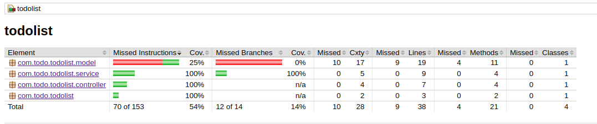

```markdown
# 📝 Spring Boot TodoList Application

A task management application built with Spring Boot for daily activity organization.

## ✨ Features

- ✅ Create, get, and delete tasks
- ✅ Mark tasks as completed
- ✅ Filter by status (all/active/completed)
- ✅ H2 in-memory database persistence
- ✅ Documented RESTful API

## � How to Run

### Prerequisites
- Java 21+
- Maven 3.6+
- (Optional) Docker for containerized version

### Local Installation
```bash
# Clone repository
git clone https://github.com/newtsarthur/spring-boot-todolist.git
cd spring-boot-todolist

# Compile and run
mvn spring-boot:run
```
## 📊 Test Coverage

---

### Access Points
- **API**: `http://localhost:8080/api/tasks`
- **Swagger UI**: `http://localhost:8080/swagger-ui.html`
- **H2 Console**: `http://localhost:8080/h2-console` (JDBC URL: `jdbc:h2:mem:todolist`)

## 🛠️ Tech Stack

| Technology       | Purpose                          |
|------------------|----------------------------------|
| Spring Boot      | Backend framework                |
| Spring Data JPA  | Data persistence                 |
| H2 Database      | In-memory development database   |
| Swagger          | API documentation                |
| Lombok           | Boilerplate code reduction       |

## 🌿 Project Structure
```
src/
├── main/
│   ├── java/
│   │   └── com/
│   │       └── example/
│   │           └── todolist/
│   │               ├── controller/   # API endpoints
│   │               ├── model/        # JPA entities
│   │               ├── repository/   # Spring Data interfaces
│   │               └── service/      # Business logic
│   └── resources/
│       ├── application.properties    # Configuration
│       └── static/                   # Frontend (if applicable)
```

## 🤝 Contributing
1. Fork the project
2. Create your branch (`git checkout -b feature/new-feature`)
3. Commit changes (`git commit -m 'Add new feature'`)
4. Push to branch (`git push origin feature/new-feature`)
5. Open a Pull Request

## 📄 License
This project is licensed under MIT - see [LICENSE](LICENSE) for details.

---